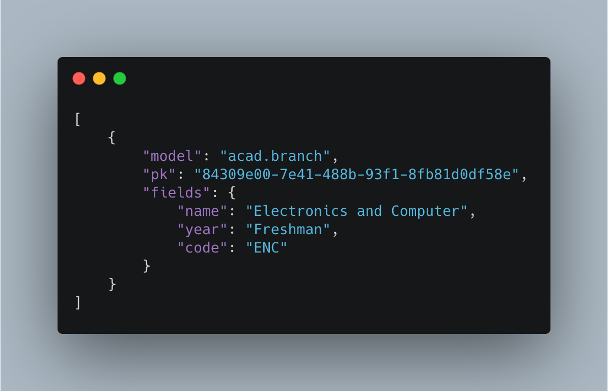
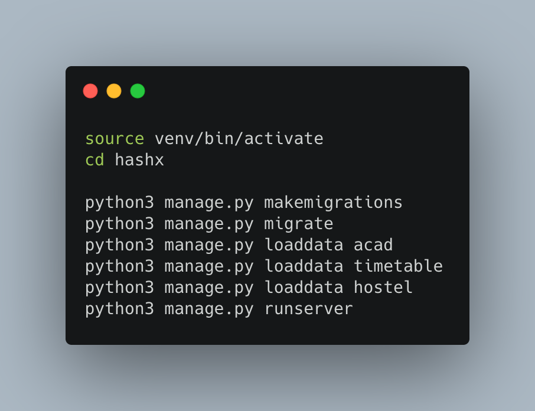
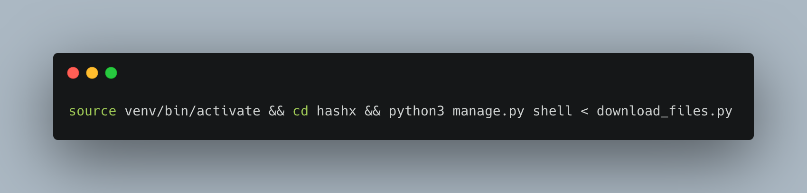

# Loading data onto servers

For our project, with the help of scraping we have gathered data and organised it in a JSON file which we can load onto our servers with simple commands.

## 1.   Fixtures: 

As of now, we have fixtures for **Branches, Courses,Files, Locations, Faculty and Hostels**. 

They all follow the same JSON format as seen in the above example and can be found within the different apps inside the fixture folders. As most of them were created with the help of scripts, if any change is required you can simply find the script folder to change the desired fixture.

To make loading more simple, we have a simple bash sript which can be run `bash ./loaddata.sh`.

With this script, we can install all the fixtures with a single command.

## 2.   Downloading Files: 

We have a bunch of files ready which can be uploaded to the server during deployment. By running the `download_files.py` inside the django shell using `python3 manage.py shell < download_files.py`, we can chose to download all the files or chose branchwise.

You can also use a bash script for this and simply run the file with using `bash ./download.sh` for ease.