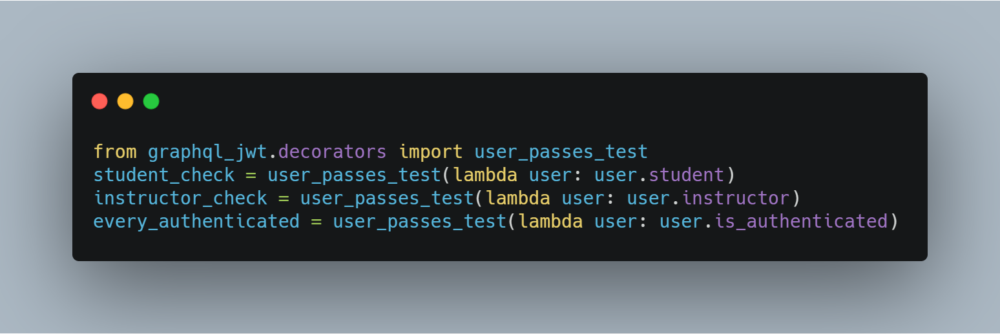
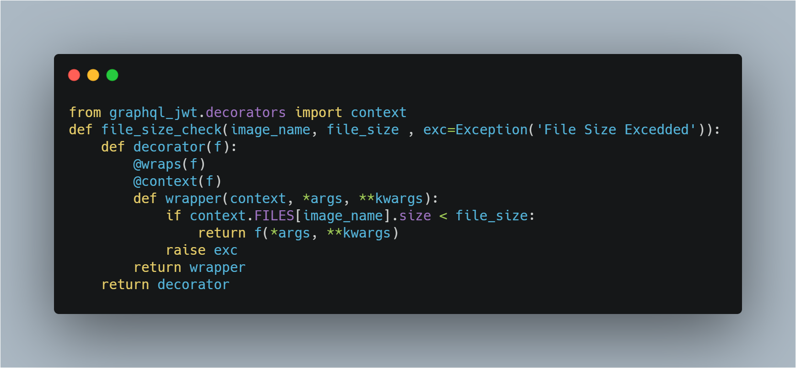
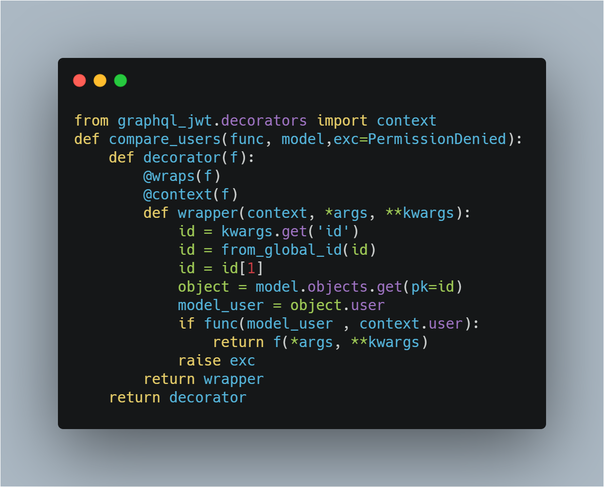
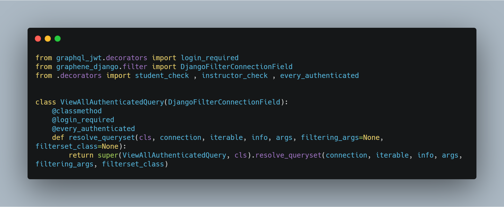
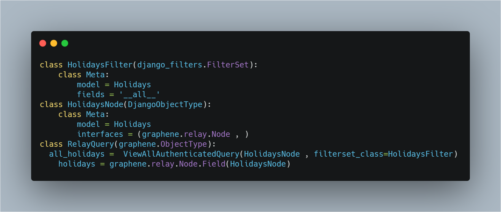
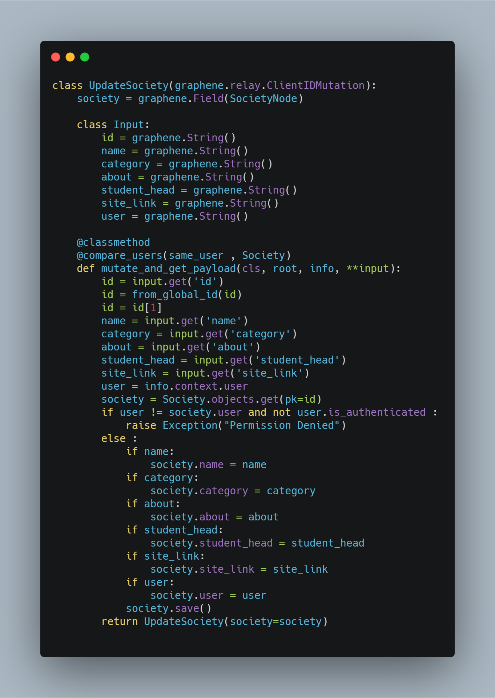

In this article we will discuss about the permission system in our app. As graphene does not have any way of adding permissions to query and mutations, we had to take a different approach and build something inhouse. 

We are using **Django GraphQL JWT** as our authentication system. Our permission system is built upon it. 

We can break the code into two parts decorators and custom clases:- 
## 1.   Decorators: 
* Simple Decorators - We get some basic decorator from **Django GraphQL JWT** itself.

Lines 2-4 checks for different condition if the user passes that particualr test or not. If it passes it proceeds if not it raise `Permission Denied exception`.
We use it to check different the category of different user wherever required. 
* File Size Check - We use this deocrator to check the size of any incoming file. We pass in the file name and the required size. We are using the context function provided to us by **Django GraphQL JWT** to get the current context through which we can extract info about the request.

* Check User validation - Its the main decorator which is user wherever we need to compare two users for eg while updating any object.
 
 This can a feel a little bit of mess at first(trust me it was for me too) but once you understand whats happeing under the hood you are good to go. Let me explain this to you. This decorator takes in 2 parameters a function and a model. The function represting how to check 2 users and model being well the object type. Some may argue we could just use the function that compare two users inside the decorators itself but this way it gives us a bit more flexibility.  
 Again we are using context decorator to get the current context. The wrapper function has kwargs which contain the relay global id for that particular node. The first three lines inside the wrapper function just extracts it converts it to UUID to which the object is connected using `from_global_id` a function provided us by `graphql_relay` then we just get the user associated to that object. Then we pass in the 2 users current logged in users and the user associated to that object
to the function we first passed inside the decorator.If everything goes well it just return `True` and proceeds forward else it raise `Permission Denied Exception`.

**You would notice something like this `f(*args ,**kwargs)` that we retrun after every True condition. In the simplest terms it just return all the info needed by the function on which we use this decorator to proceed furthere** 

You might think this is preety much everything need to proceed and implement it in our codebase. Well thats not entierly true. Well this sure is necessary if we were not using `Relay` in our queries, but we are because it helps to use defualt queries to filter out queries. You can read more about that `here`. 
**Schema of one of the models**

This is one of the standard way of writing the schema for  `GraphQL  Queries` using relay. It just manage every kind of filtering on its own so we don't need to resolve anything. More Advantages `here`. As it does eveything under the hood there was no way of adding our decorators to this. Here comes in our Custom Classes

## 2. Custom Classes:
 What we came up to solve this problem was our own custom classes.
 
 Here we extend `DjangoFilterConnectionField` into one of our own class and overrides it's `resolve_queryset` method and add our custom decorator to it and return everything from the parent class and it just works. So our new schema looks like this.
 
We have a few different types of classes for every possible condition. Check `custom_classes` file inside the hashx folder to check rest of the classes.

## A few code snippets:
